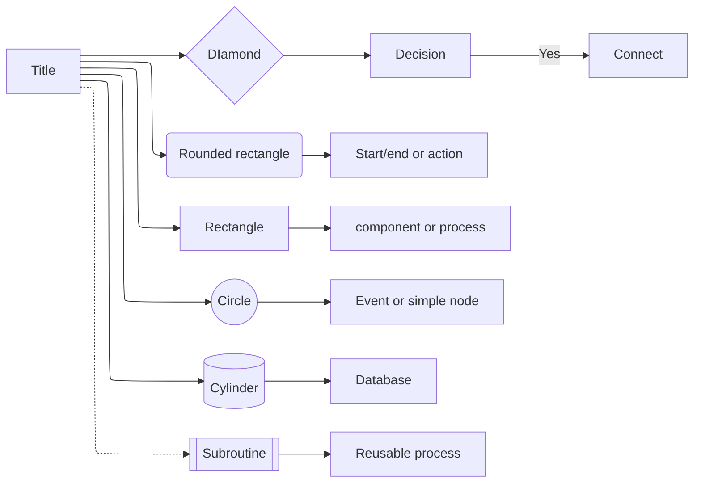
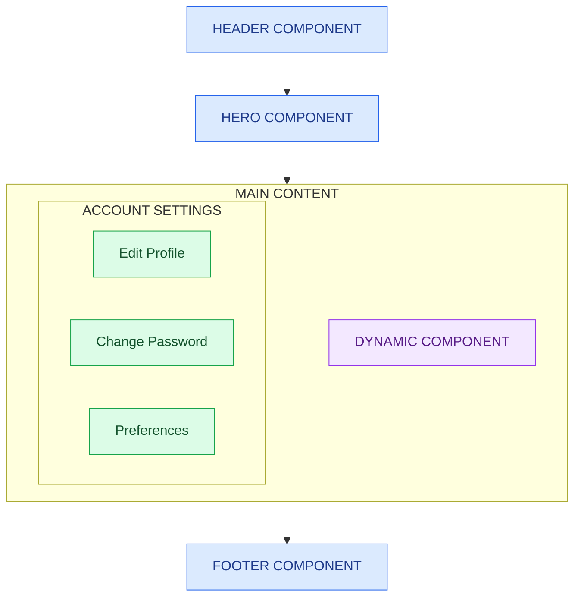

```mermaid
---
config:
  layout: elk
  elk:
    <!-- mergeEdges: true -->

---
flowchart LR
    A[Title]
    B{DIamond} --> G -->|Yes| N
    C(Rounded rectangle) --> F
    D[Rectangle] --> E
    H((Circle)) --> I
    J[(Cylinder)] --> K
    L[[Subroutine]] --> M

    N[Connect]

    E[component or process]
    F[Start/end or action]
    G[Decision]
    I[Event or simple node]
    K[Database]
    M[Reusable process]

    A --> B
    A --> C
    A --> D
    A --> H
    A --> J
    A -.-> L
```

## User Profile Page Architecture

```mermaid
flowchart TB
    Header["HEADER COMPONENT"]
    Hero["HERO COMPONENT"]

    subgraph MainContent["MAIN CONTENT"]
        direction LR

        subgraph Sidebar["ACCOUNT SETTINGS"]
            direction TB
            Profile["Edit Profile"]
            Password["Change Password"]
            Preferences["Preferences"]
        end

        Dynamic["DYNAMIC COMPONENT"]
    end

    Footer["FOOTER COMPONENT"]

    Header --> Hero
    Hero --> MainContent
    MainContent --> Footer

    Profile ~~~ Dynamic
    Password ~~~ Dynamic
    Preferences ~~~ Dynamic

    classDef layout fill:#dbeafe,stroke:#2563eb,color:#1e3a8a
    classDef sidebar fill:#dcfce7,stroke:#16a34a,color:#14532d
    classDef dynamic fill:#f3e8ff,stroke:#9333ea,color:#581c87

    class Header,Hero,Footer layout
    class Profile,Password,Preferences sidebar
    class Dynamic dynamic
```
